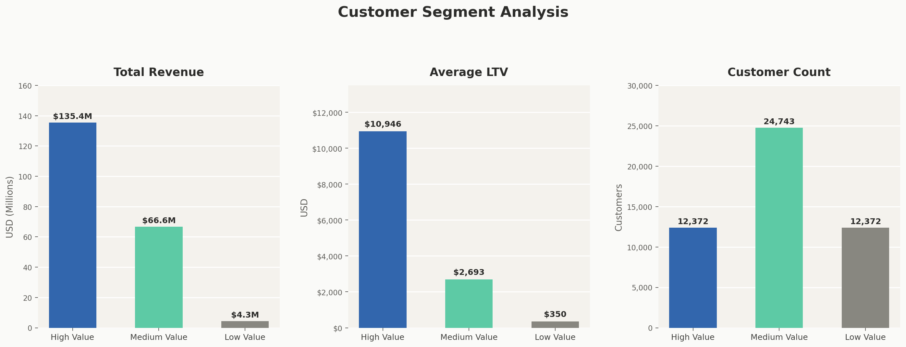
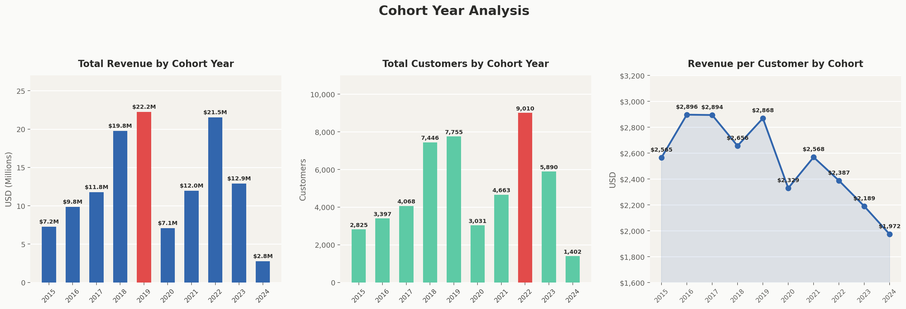
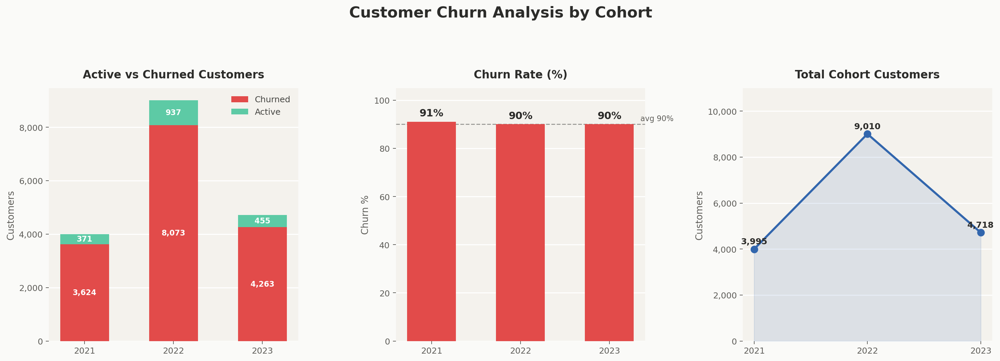

# CONTOSO_100K - Sales Analysis

## Overview
Analysis of customer behavior, retention, and lifetime value for an e-commerce company to improve customer retention and maximize revenue.

## Business Questions
1. **Customer Segmentation:** Who are our Companys  valuable customers?
2. **Cohort Analysis:** How do different customer groups generate revenue?
3. **Retention Analysis:** Which customers haven't purchased recently?

## Analysis Approach

### 1. Customer Segmentation Analysis
- Categorized customers based on total lifetime value (LTV)
- Assigned customers to High, Mid, and Low-value segments
- Calculated key metrics: total revenue

🖥️ Query: [customer_segementation.sql](/Scripts/q1.sql)

**📈 Visualization:**

📊 **Key Findings:**
- **High value customers punch way above their weight** — 12,372 customers (25% of base) generate $135.4M (66% of total revenue). Losing even a fraction of this group would have an outsized impact.

- **The 31x LTV gap signals a broken upgrade path** — High value averages $10,946 vs. Low value at just $350. This extreme spread suggests Low value customers are either one-time buyers or deeply disengaged. 

- **Medium value is the growth lever hiding in plain sight** — With 24,743 customers (50% of the base) averaging $2,693 LTV, even nudging 20% of them toward High value behavior would add ~$40M+ in revenue

### 2. Cohort Analysis
- Tracked revenue and customer count per cohorts
- Cohorts were grouped by year of first purchase
- Analyzed customer retention at a cohort level

🖥️ Query: [cohort_analysis.sql](/Scripts/q2.sql)

**📈 Visualization:**

📊 **Key Findings:**
- **2019 and 2022 were breakout years** — both hit peak revenue ($22.2M and $21.5M) and peak customer acquisition (7,755 and 9,010).

- **Revenue per customer has been steadily declining since 2016** — dropping from $2,896 in 2016 to $1,972 in 2024

- **2020 is a clear anomaly** — revenue ($7.1M) and customers (3,031) both cratered despite being sandwiched between strong years. Likely COVID impact, but worth validating whether those cohort customers also have lower lifetime retention compared to adjacent years.

### 3. Customer Retention
🖥️ Query: [retention_analysis.sql](/Scripts/q3.sql)

- Identified customers at risk of churning
- Analyzed last purchase patterns
- Calculated customer-specific metrics

**📈 Visualization:**

📊 **Key Findings:**  
- **Churn is alarmingly consistent at ~90% across all three years** — this isn't a one-off problem, it's a structural one. 9 out of 10 customers acquired in 2021, 2022, and 2023 did not stay active, suggesting a fundamental issue with product-market fit, onboarding, or post-purchase experience.  

- **2022 was the biggest acquisition year (9,010 customers) but also the biggest churn year (8,073 lost)** — the volume spike didn't translate to retention. If those customers came from a specific campaign or channel, that source is likely bringing in low-intent buyers worth deprioritizing.

- **Active customers are a tiny but valuable base** — only 1,763 customers remain active across all three cohorts combined (371 + 937 + 455). These survivors likely represent your highest-value, most loyal users and deserve dedicated analysis to understand what made them stick — and how to attract more like them.

## Strategic Recommendations

1. **Customer Value Optimization** (Customer Segmentation)
   - Launch VIP program for 12,372 high-value customers (66% revenue)
   - Create personalized upgrade paths for mid-value segment ($66.6M → $135.4M opportunity)
   - Design price-sensitive promotions for low-value segment to increase purchase frequency

2. **Cohort Performance Strategy** (Customer Revenue by Cohort)
   - Target 2022-2024 cohorts with personalized re-engagement offers
   - Implement loyalty/subscription programs to stabilize revenue fluctuations
   - Apply successful strategies from high-spending 2016-2018 cohorts to newer customers

3. **Retention & Churn Prevention** (Customer Retention)
   - Strengthen first 1-2 year engagement with onboarding incentives and loyalty rewards
   - Focus on targeted win-back campaigns for high-value churned customers
   - Implement proactive intervention system for at-risk customers before they lapse

## Technical Details
- **Database:** PostgreSQL
- **Analysis Tools:** PostgreSQL, DBeaver, PGadmin
- **Visualization:** ChatGPT, Claude
